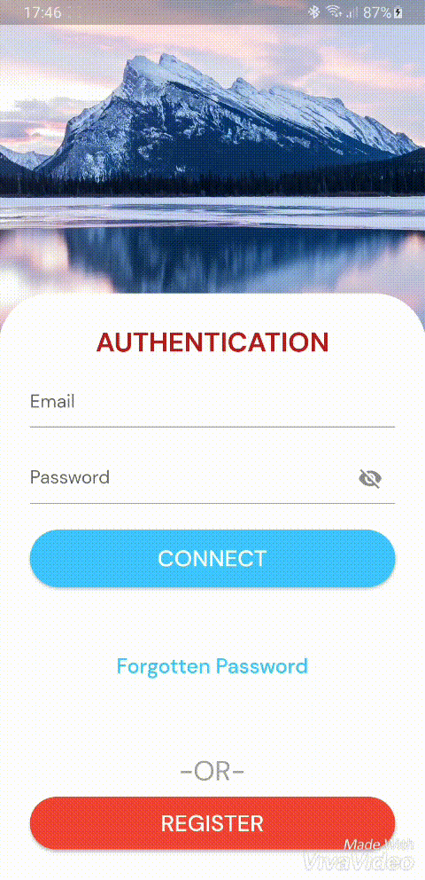
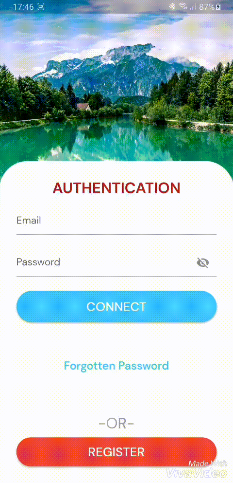
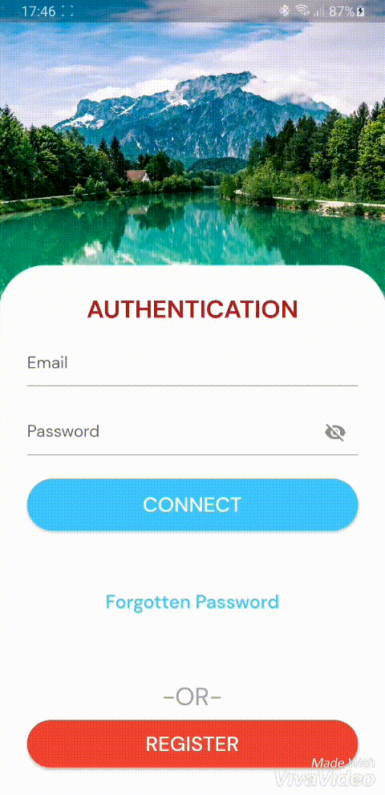
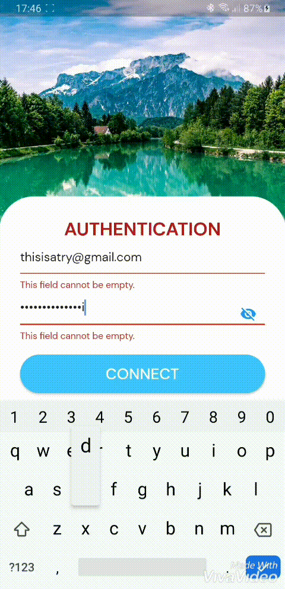
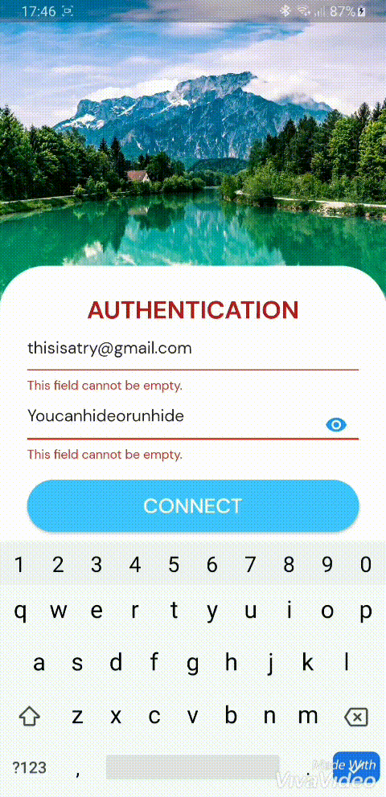

# Single Page UI

Single Authentication Page as a Coding Exercise.

## Demo

### Fade Image

### Forgot Password Page Transition

### Register Page Transition

### Button Change Color
The Connect Button changes color when highlighted. It's the same for the Register button

### Hide or Unhide Password

### Login Snackbar

